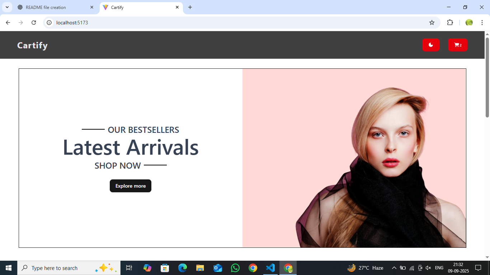
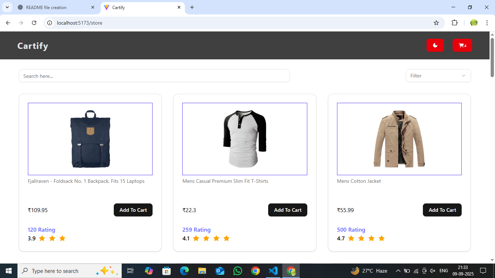
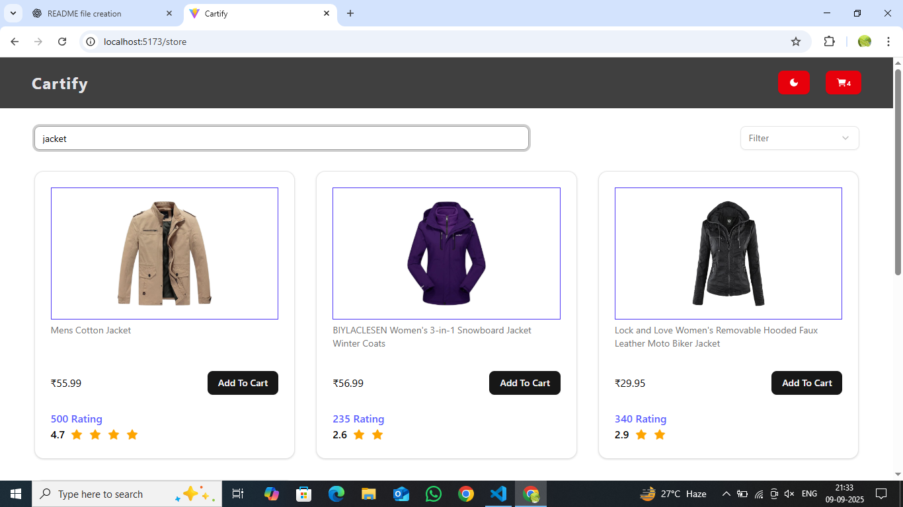
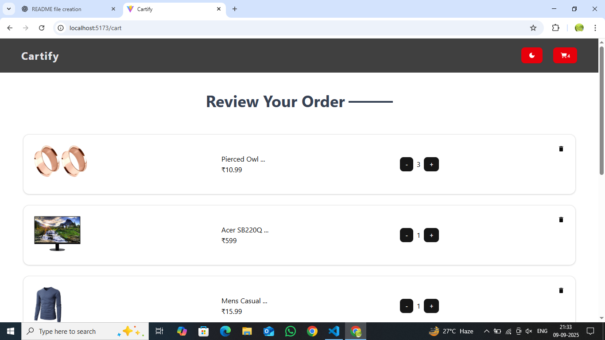
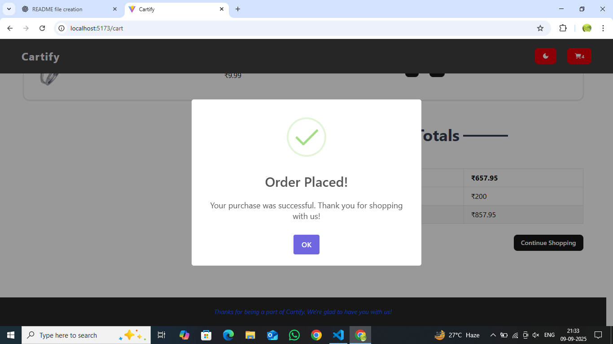

# Store Application

A simple and responsive e-commerce store built with **React, TypeScript, Vite**, and styled using **Tailwind CSS** with **shadcn/ui** components. The project demonstrates clean state management, dynamic routing, API integration, and modern UI/UX patterns.

## Features

1. Responsive Home Page ("/") with a clean and adaptive layout.
2. Store Page ("/store") with products fetched from [Fake Store API](https://fakestoreapi.com/products).
3. Skeleton loader (shimmer effect) implemented using shadcn/ui while products are loading.
4. Search filter with throttling for optimized performance.
5. Multiple filters (search, category, price sorting).
6. Add to Cart functionality with items persisted in localStorage.
7. Cart Page ("/cart") to view, increase, decrease, and remove items.
8. SweetAlert2 integrated for beautiful alerts and toast notifications.
9. Context API with useReducer for state management of products and cart.
10. Dark/Light mode toggle with persistent theme support.

## Tech Stack

- React
- TypeScript
- Vite
- Tailwind CSS
- shadcn/ui
- React Router DOM
- SweetAlert2

